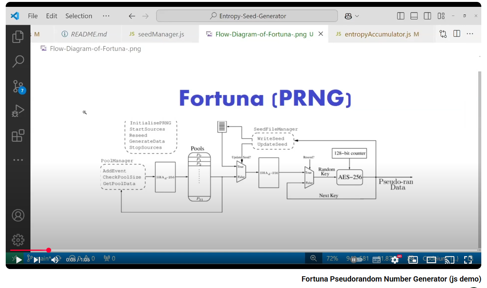

---

# Fortuna PRNG (Pseudorandom Number Generator)

## Overview

This project implements the **Fortuna Pseudorandom Number Generator (PRNG)** in C++. Fortuna is a cryptographically secure PRNG designed by Bruce Schneier and colleagues. It combines multiple entropy sources and utilizes AES-256 in Counter mode (AES-CTR) to generate random numbers.

[Video: Fortuna Pseudorandom Number Generator (js demo)](https://www.youtube.com/watch?v=wMo0AlM8-xU)

<a href="https://www.youtube.com/watch?v=wMo0AlM8-xU">
  
</a>

### Key Features:
- **Cryptographically secure** random number generation.
- **AES-256-CTR** for encryption of random data.
- **SHA-256** for entropy mixing and key re-seeding.
- **Entropy accumulator**: Collects entropy from multiple sources.
- **Automatic re-seeding**: Ensures continuous randomness through key updates.
- **OpenSSL** used for cryptographic operations.

The implementation is based on an original JavaScript version of the Fortuna algorithm, ported into C++ for improved performance and integration with OpenSSL.

---

## Table of Contents
- [Installation](#installation)
- [How It Works](#how-it-works)
- [Usage](#usage)
- [License](#license)
- [Credits](#credits)

---

## Installation

### Prerequisites

To compile and run this project, you need:
- **C++11** or higher.
- **OpenSSL** (for cryptographic operations like AES and SHA-256).
- **A C++ compiler** such as `g++`.

#### 1. Install OpenSSL

Before running the project, ensure that OpenSSL is installed on your system.

For **Ubuntu/Debian**:

```bash
sudo apt-get install libssl-dev
```

For **macOS (using Homebrew)**:

```bash
brew install openssl
```

For **Windows**, you can download the OpenSSL binaries from the [official site](https://slproweb.com/products/Win32OpenSSL.html).

---

### 2. Clone the Repository

Clone this repository to your local machine:

```bash
git clone https://github.com/yourusername/Fortuna-PRNG.git
cd Fortuna-PRNG
```

---

### 3. Build the Project

Use the `Makefile` to build the project:

```bash
make
```

This will compile the project and generate an executable named `fortuna`.

---

## How It Works

### 1. **Entropy Accumulation**

Fortuna relies on entropy from external sources (such as hardware randomness, user input, etc.) to generate its random numbers. The entropy is accumulated into multiple pools. When enough entropy is gathered, it is mixed using the `SHA-256` hashing algorithm.

### 2. **Key Generation**

The PRNG is seeded with a 256-bit initial key. If this key is not found, a new one is generated using OpenSSL’s `RAND_bytes` function and saved to a file (`seed.dat`).

### 3. **Random Data Generation**

The `Generator` class uses AES-256 in CTR mode to generate pseudorandom data. A counter is incremented with every block of data generated, and the output is XORed with the encrypted counter block to produce the random values.

### 4. **Re-seeding**

Periodically, the key is re-seeded using new entropy. When the data limit is reached, a rekey operation is triggered by hashing the current key with `SHA-256` to prevent predictability and maintain randomness.

---

## Usage

Once the project is compiled, you can run it by executing the following command:

```bash
make run
```

This will trigger a simple test, where the system will:
- Collect some entropy manually (you can modify this part to use real entropy sources).
- Reseed the Fortuna generator.
- Generate 32 bytes of random data.

The random data will be printed in hexadecimal format, for example:

```
Generated random data: 3f85a279f8b3b27f7c23298c9e5ffabf4e8c3a80db4b1e03a0df98c242d1c5fa
```

---

## Advanced Usage

You can also directly interact with the `Fortuna` class to perform operations like adding entropy, reseeding, and generating random bytes.

Example:

```cpp
Fortuna fortuna;

// Adding entropy manually
std::vector<uint8_t> testEntropy = {0x01, 0x02, 0x03, 0x04};
fortuna.getAccumulator().addEntropy(testEntropy);

// Reseeding and generating random bytes
fortuna.reseed();
auto randomData = fortuna.getRandomBytes(64);

std::cout << "Generated 64 bytes of random data: ";
for (uint8_t byte : randomData) {
    printf("%02x", byte);
}
std::cout << std::endl;
```

This code demonstrates how to add entropy, reseed the generator, and retrieve a specific number of random bytes.

---

